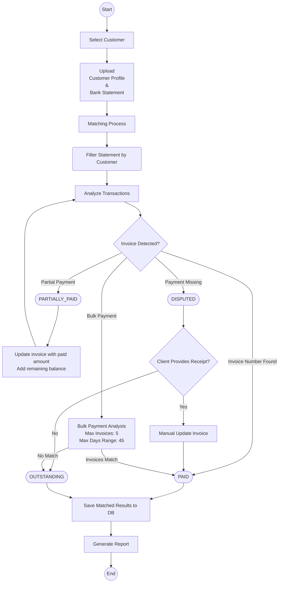

## Payment Tracking

```mermaid
flowchart TD
    START((Start))
    START --> SELECT_CUSTOMER[Select Customer]
    SELECT_CUSTOMER --> UPLOAD_FILES[Upload<br> Customer Profile<br>&<br>Bank Statement]


    UPLOAD_FILES --> MATCHING[Matching Process]
    MATCHING --> FILTER(Filter Statement by Customer)
    FILTER --> ANALYZE[Analyze Transactions]

    ANALYZE --> DECISION{Invoice Detected?}

    DECISION -- Invoice Number Found --> PAID([PAID])

    DECISION -- Partial Payment --> PARTIAL([PARTIALLY_PAID])
    PARTIAL --> UPDATE_PARTIAL[Update invoice with paid amount<br>Add remaining balance]

    DECISION -- Bulk Payment --> BULK[Bulk Payment Analysis<br>Max Invoices: 5<br>Max Days Range: 45]

    DECISION -- Payment Missing --> DISPUTED([DISPUTED])

    DISPUTED --> CLIENT_PROOF{Client Provides Receipt?}
    CLIENT_PROOF -- Yes --> MANUAL_UPDATE[Manual Update Invoice]
    MANUAL_UPDATE --> PAID
    CLIENT_PROOF -- No --> OUTSTANDING([OUTSTANDING])

    BULK -- Invoices Match --> PAID
    BULK -- No Match --> OUTSTANDING

    UPDATE_PARTIAL --> ANALYZE

    PAID --> PERSISTENT[Save Matched Results to DB]
    OUTSTANDING --> PERSISTENT
    PERSISTENT --> REPORT[Generate Report]
    REPORT --> END((End))
```
