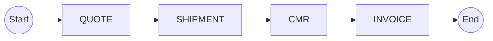
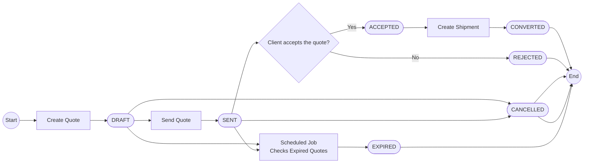
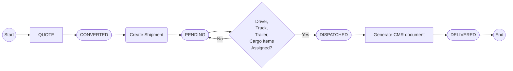
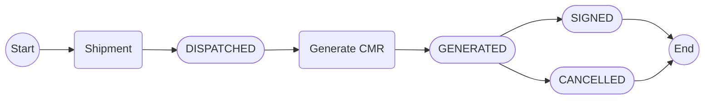

## High Level Diagram

```mermaid
flowchart LR
    START((Start))
    START --> QUOTE[QUOTE]
    QUOTE --> SHIPMENT[SHIPMENT]
    SHIPMENT --> CMR[CMR]
    CMR --> INVOICE[INVOICE] --> END((End))
```

## Quotes

```mermaid
flowchart LR
    START((Start))
    START --> CREATE_QUOTE[Create Quote]
    CREATE_QUOTE --> DRAFT([DRAFT])

    DRAFT --> SEND_QUOTE[Send Quote]
    SEND_QUOTE --> SENT([SENT])
    SENT --> DECISION{Client accepts the quote?}
    DECISION -- Yes --> ACCEPTED([ACCEPTED])
    ACCEPTED --> CREATE_SHIPMENT[Create Shipment]
    CREATE_SHIPMENT --> CONVERTED([CONVERTED]) --> END((End))

    DECISION -- No --> REJECTED([REJECTED]) --> END

    DRAFT --> CANCELLED([CANCELLED]) --> END
    SENT --> CANCELLED --> END

    DRAFT --> SCHEDULED_JOB[Scheduled Job<br>Checks Expired Quotes]
    SENT --> SCHEDULED_JOB
    SCHEDULED_JOB --> EXPIRED([EXPIRED]) --> END
```

## Shipments

```mermaid
flowchart LR
    START((Start))
    START --> QUOTE[QUOTE]
    QUOTE --> CONVERTED([CONVERTED])
    CONVERTED --> CREATE_SHIPMENT(Create Shipment)
    CREATE_SHIPMENT --> PENDING([PENDING])

    PENDING --> ASSIGNED{Driver,<br>Truck,<br>Trailer,<br>Cargo Items<br> Assigned?}
    ASSIGNED -- No --> PENDING
    ASSIGNED -- Yes --> DISPATCH([DISPATCHED])

    DISPATCH --> CMR[Generate CMR document]
    CMR --> DELIVERED([DELIVERED])
    DELIVERED --> END((End))
```

## CMR

```mermaid
flowchart LR
    START((Start)) --> SHIPMENT(Shipment)
    SHIPMENT --> DISPATCHED([DISPATCHED])
    DISPATCHED --> GENERATED_CMR(Generate CMR)
    GENERATED_CMR --> GENERATED([GENERATED])
    GENERATED --> SIGNED([SIGNED]) --> END((End))
    GENERATED --> CANCELLED([CANCELLED]) --> END
```
