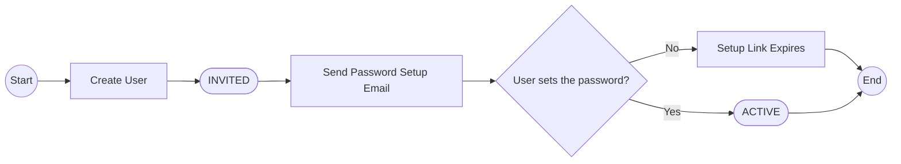

## User Invitation

```mermaid
flowchart LR
    START((Start)) --> CREATE_USER[Create User]
    CREATE_USER --> INVITED([INVITED])
    INVITED --> SEND_PASSWORD_SETUP_MAIL[Send Password Setup Email]

    SEND_PASSWORD_SETUP_MAIL --> USER_SETS_PASSWORD{User sets the password?}
    USER_SETS_PASSWORD -- No --> LINK_EXPIRES[Setup Link Expires]
    USER_SETS_PASSWORD -- Yes --> ACTIVE([ACTIVE])

    LINK_EXPIRES --> END((End))
    ACTIVE --> END
```
